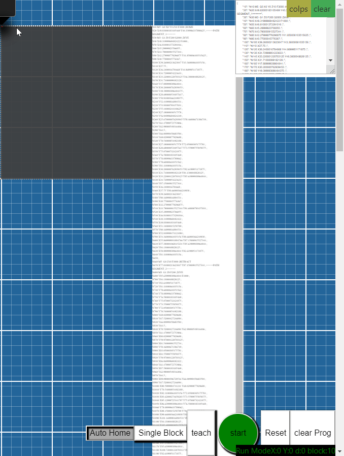

# CNCCSS

## Web application using javascript and css to visualize gcode cutting paths. Transform touch drawn paths into CNC GCODE for industrial milling machines and lasers.

Transform your handwriting into production ready tool path. This is CSS and Javascript take on CAD/CAM software. 
[Demo here](https://osmiogrzesznik.github.io/cnccss/cnccss.html)

